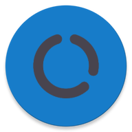
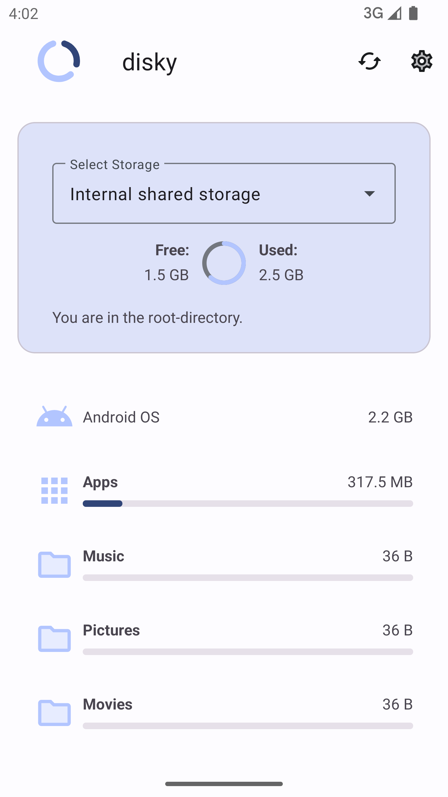
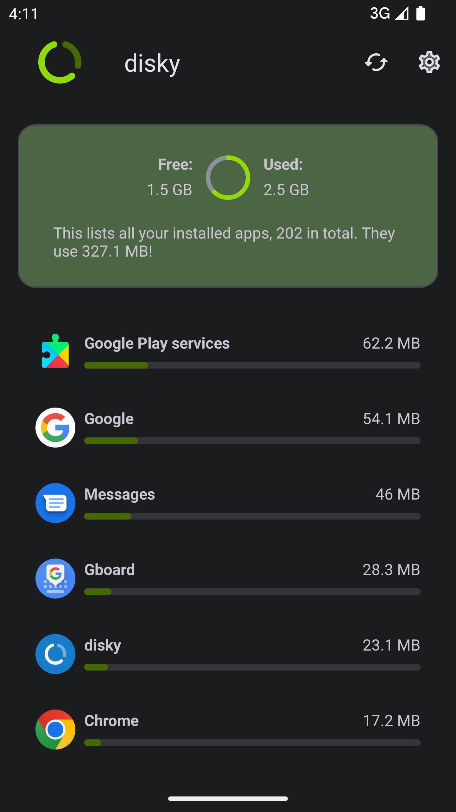
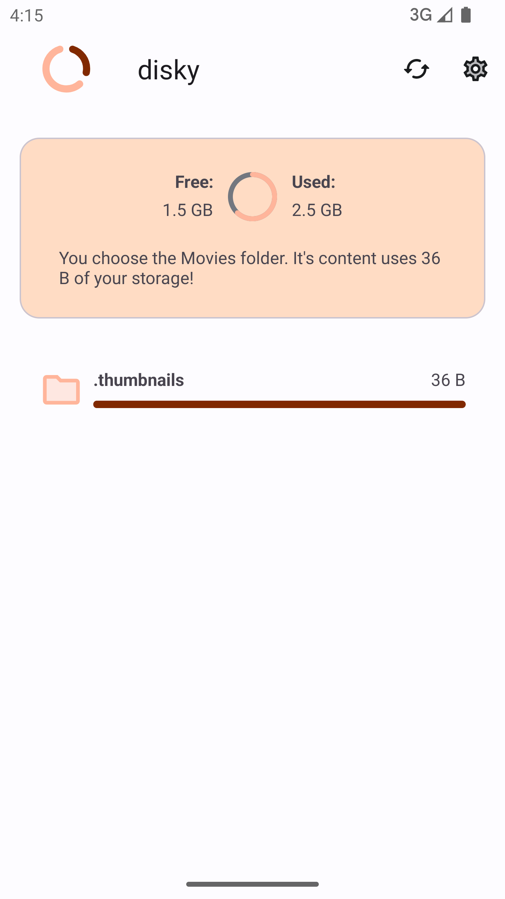

<div align="center">
<p></p>

---
# disky
### Find your biggest diskspace thieves!

---

[](https://github.com/newhinton/disky/blob/master/LICENSE) [](https://github.com/newhinton/disky/releases) [](https://github.com/newhinton/disky/releases/latest)
[](https://felixnuesse.de/disky) [](https://github.com/newhinton/disky/actions/workflows/lint.yml)

[](https://f-droid.org/packages/de.felixnuesse.disky)

</div>

-----------
A filesystem analyzer that can show you the usage of your storage!
<br/>
<br/>

Screenshots
-----------

<table align="center">
  <tr style="border:none">
    <td style="border:none">
      
    </td>
    <td style="border:none">
      
    </td>
    <td style="border:none">
      
    </td>
  </tr>
</table>


Features
--------

- **Fast** Even larger devices can be scanned in mere seconds!
- **Multi Storage** All your local filesystems are supported!
- **Material You** Fits your device's theme!

Installation
------------
Grab the [latest version](https://github.com/newhinton/disky/releases/latest) of the signed APK and install it on your phone.


Developing
------------

You should first make sure you have cloned this repository:


```sh
git clone https://github.com/newhinton/disky

```


You can then build the app normally from Android Studio or from CLI by running:

```sh
# build
./gradlew assemble

```


Contributing
------------
See [CONTRIBUTING](./CONTRIBUTING.md)

Anyone is welcome to contribute and help out. However, hate, discrimination and racism are decidedly unwelcome here. If you feel offended by this, you might belong to the group of people who are not welcome. I will not tolerate hate in any way.


Donations
------------

If you like my work, either this app or in general, you are more than welcome to leave a donation.
It helps me to dedicate time to further improve my apps!

[Paypal](https://www.paypal.com/paypalme/felixnuesse) | [Liberapay](https://liberapay.com/newhinton) | [Github Sponsor](https://github.com/sponsors/newhinton)


About this app
-----------------
### License
This app is released under the terms of the [GPLv3 license](https://gitea.felixnuesse.de/felix/disky/blob/master/LICENSE). 
There are older releases that accidentially contained the wrong license file, namely MIT.
This entire Repository is and was GPLv3, as stated by this Readme in this section, and the pill below the title on top of this document.
It was also stated in the app itself.


### Libraries
- [AppIntro](https://github.com/AppIntro/AppIntro) - This library is responsible for the easy-to-use introduction to the app!
- [Lottie](https://github.com/airbnb/lottie-android) - This library makes the fancy animation possible!
- [Undraw](https://undraw.co/) - Not really a library, but without Undraw's Images, this app wouldn't be the same!

Thanks to all of them! 
